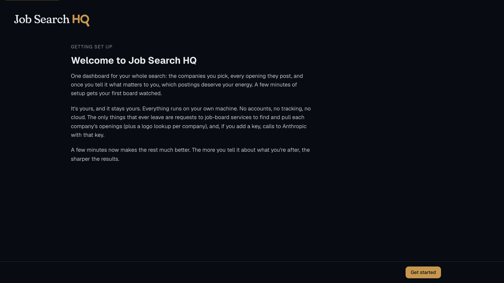
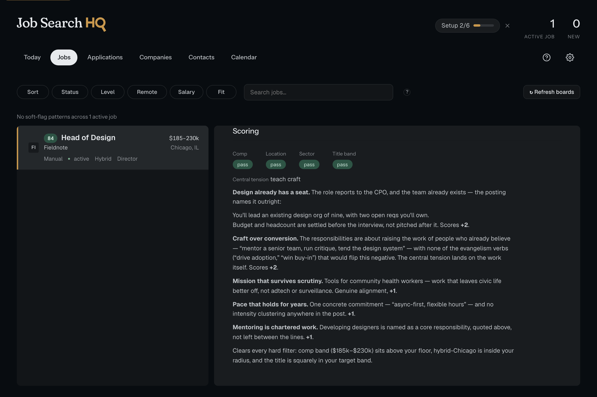
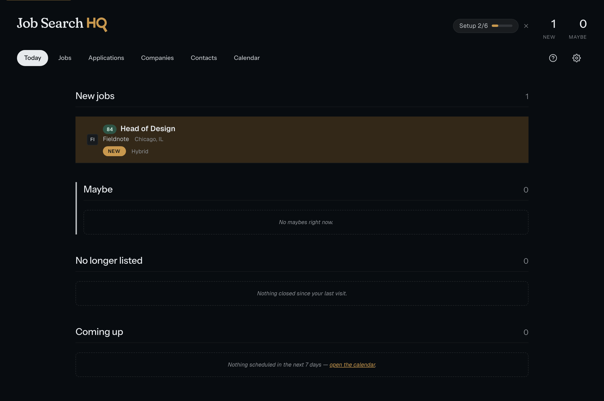

# Job Search HQ (jshq)

**Status: beta, a solo project under active development.** Issues and
feedback are welcome; there are no formal support or stability guarantees yet.

A personal, local-first job-search dashboard: track target companies, pull their
openings directly from applicant-tracking-system job boards, score every
posting against your own written fit criteria (optionally with AI, using your
own Anthropic API key), and manage applications, contacts, and reminders, all
on your own machine.

## Walkthrough

**Setup is the application.** A fresh install boots into a wizard that _is_ the
whole app (no empty dashboard to bounce off of) and leads with the privacy
promise.



**The scoring reader shows its work.** Every posting is scored against the
wish-list criteria you ranked, and each criterion is mapped to evidence from the
actual posting. Every score shows its reasoning.



**The tracker never fakes progress.** A persistent "Setup N of N" pill tracks
real completeness, fed verbatim by the backend's own count.



> **Why these choices?** The senior decisions here are design and systems
> judgment carried into code: a setup flow designed as reflection rather than a
> form, a token architecture that catches its own theme gaps, scoring that
> lives in a document _you_ write, and a color-blind-safe state model with a
> simulator guarding it. The **[case study](docs/CASE-STUDY.md)** walks through
> each and names the things deliberately left unbuilt.

## Principles

- **Local only.** One process on localhost. Your data lives in a SQLite file
  you own. No accounts, no server, no sync.
- **Zero tracking.** No telemetry, no crash reporting, no update pings, no
  install beacons. The app talks to job-board services for the companies you
  add (finding and pulling their openings, plus a per-company logo lookup)
  and to the Anthropic API with your own key (AI features are optional; the
  app works without a key). [PRIVACY.md](PRIVACY.md) is the complete
  inventory of every request.
- **Cross-platform.** Python + FastAPI + a framework-free web frontend.
  Mac, Windows, and Linux.
- **Your criteria are the product.** Scoring is driven by a criteria document
  you author: hard filters (comp, location, sector, seniority) and weighted,
  ranked criteria in your own words. You can read and change exactly what drives
  every score.

## Install and run

```
pip install .
jshq
```

Then open http://127.0.0.1:5747. First run creates a data directory
(`~/Library/Application Support/jshq` on macOS, `%LOCALAPPDATA%\jshq` on
Windows, `~/.local/share/jshq` on Linux, or wherever `JSHQ_DATA_DIR`
points) seeded with editable copies of the example fit-criteria doc and the
voice guide. `jshq refresh` runs one ATS ingestion pass; point your scheduler
of choice (launchd, Task Scheduler, cron) at it twice a day.

`jshq backup` takes one verified backup (a SQLite snapshot plus dated
copies of your criteria doc, voice guide, roadmap, resume content, and a
mirror of uploaded application files) into `backups/` inside the data
directory, keeping the newest 30 of each. Schedule it nightly the same way
(`0 2 * * * jshq backup` in cron, a `schtasks` daily task on Windows, a
launchd agent on macOS). The `.env` holding your API key is deliberately
not included; copy it somewhere safe yourself.

To use the optional AI features, open **Settings → System** and paste your
Anthropic API key. It is saved to a `.env` in your data directory on this
machine and sent only to api.anthropic.com. The same screen lets you set your
persona (the name the AI writes as, or none) and edit your voice guide. Without
a key the app runs fully; AI features simply stay off with an in-app note.

PDF rendering (resume/cover letters) uses an installed Chrome, Chromium,
or Edge; set `JSHQ_CHROME` if yours lives somewhere unusual.

## Development

```
python3.12 -m venv .venv
.venv/bin/pip install -e . --group dev
.venv/bin/pytest
```

Copy `.env.example` to `.env` and set `JSHQ_DATA_DIR=./data` to keep dev
data inside the checkout.

## Credits

Built by [Chris Hays](https://noestudios.com). The repository is at
[github.com/noestudios/jshq](https://github.com/noestudios/jshq).

The onboarding's two reflection exercises (the ranked wish list and the
fulfillment matrix) are adapted from tier-list ranking and fulfillment-matrix
exercises by [Kristin Chen](https://www.kristinmchen.com). Visit
[www.kristinmchen.com](https://www.kristinmchen.com) for her career coaching,
startup advising, and fractional CPO services. Thank you, Kristin.

## License

AGPL-3.0. See [LICENSE](LICENSE).
